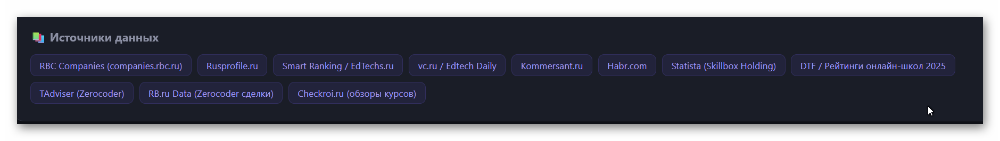

# Workspace: Bots-01 🤖

Этот репозиторий содержит материалы исследования и разработки в рамках проекта **Sales AI Bot** — интеллектуального чат-бота для автоматизации коммуникаций отдела продаж IT-компании (NexusCode).

## 🖥️ Превью лендинга (NexusCode)
Ниже представлен скриншот разработанного лендинга с интерактивным виджетом чата:

---

## 📁 Структура проекта

* **[sales_ai_bot/](file:///d:/Dev/opencode-ex/Investigation/Bots-01/sales_ai_bot)** — Основная директория проекта. Содержит:
  * Бэкенд на FastAPI (`app/`)
  * Статические файлы лендинга и JavaScript-виджет чата (`landing/`, `widget/`)
  * Конфигурации Docker и Nginx (`Dockerfile`, `docker-compose.yml`, `nginx.conf`)
  * Документацию по запуску и тестированию (`README.md`, `TESTING.md`, `INTEGRATION.md`)
* **[doc/](file:///d:/Dev/opencode-ex/Investigation/Bots-01/doc)** — Дополнительные материалы, включая [Диалог с заказчиком.txt](file:///d:/Dev/opencode-ex/Investigation/Bots-01/doc/%D0%94%D0%B8%D0%B0%D0%BB%D0%BE%D0%B3%20%D1%81%20%D0%B7%D0%B0%D0%BA%D0%B0%D0%B7%D1%87%D0%B8%D0%BA%D0%BE%D0%BC.txt)
* **[init_project.py](file:///d:/Dev/opencode-ex/Investigation/Bots-01/init_project.py)** — Скрипт инициализации базовой структуры каталогов проекта.

---

## 🚀 Быстрый запуск

Для получения подробных инструкций по запуску, настройке переменных окружения и тестированию бэкенда перейдите в **[README.md внутри sales_ai_bot](file:///d:/Dev/opencode-ex/Investigation/Bots-01/sales_ai_bot/README.md)**.
